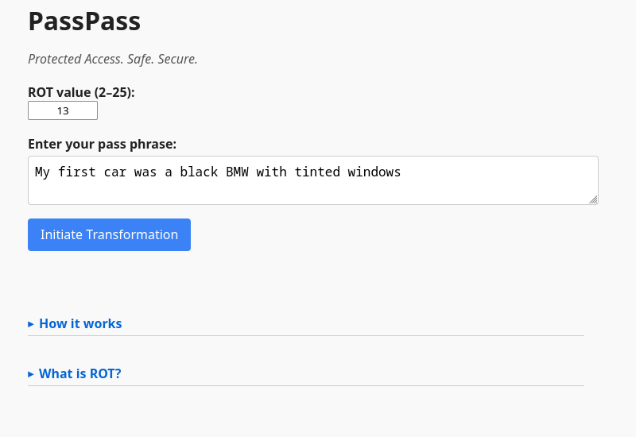

# PassPass – Protected Access Safe Secure

**Generate strong, deterministic passwords from natural phrases — processed with reversible logic (ROT-N + enhancements) — usable online, offline, or even with pen and paper.**

---

## 🔗 Try It Now

- **Live demo**: [https://ernstrenner.com/passpass.html](https://ernstrenner.com/passpass.html)
- **Clone or download**: open [`passpass.html`](./passpass.html) locally or on any device

---

## Why PassPass?

PassPass is a privacy-first, no-storage password generator for travelers, creators, and anyone who prefers logic over cloud sync.

- No password vaults required
- 100% offline and works with any browser
- Reconstructable with pen and paper
- Designed to live in your **brain**, not your device

---

## How It Works

1. Enter a **ROT-N** value (2–25)
2. Input a **memorable phrase** like:  
   `My favorite ice cream is Erdbeer Eis!`
3. Behind the scenes, PassPass:
   - Applies a Caesar cipher (ROT-N) to A–Z / a–z only
   - Leaves numbers, punctuation, and emojis untouched
   - Removes spaces
   - Reverses the final string

⚙️ The result is a **strong, repeatable password** — with no storage or syncing needed.

---

## Example

> **ROT**: `5`  
> **Phrase**: `Ice cream in Vienna is awesome!`  
> **→ Output**: `!jtrjxbtNXNfnnsnjHTZHVjhj`

---

## How to Use

- Download or clone this repo
- Open `passpass.html` in any browser (works offline)
- Set your ROT and phrase
- Click **Transform**
- Copy your generated password directly

---

## Manual Method (No Device)

If needed, PassPass can be reconstructed without a computer:

1. Manually ROT each letter using your ROT value
2. Remove all spaces
3. Reverse the result string

That's it. Your password is always recoverable — by logic alone.

---

## 🔐 Security Philosophy

PassPass is not encryption — it’s transformation.  
It gives you back control using layered logic that only *you* know:

- ✅ ROT-based transformation (user-chosen)
- ✅ Standard space stripping + string reversal
- ✅ Deterministic output — no secrets stored

Because nothing is stored, leaked, or synced — *there’s nothing to steal.*

---

## 📄 License

Released under the [Apache License, Version 2.0](./LICENSE)

---

## 📖 Learn More

Want to understand the mindset and use cases behind PassPass?

📝 **Read the companion blog post:**  
[PassPass: A Robust Password Generator for People on the Move](https://ernstrenner.com/members/passpass-a-robust-password-generator-for-people-on-the-move/)
